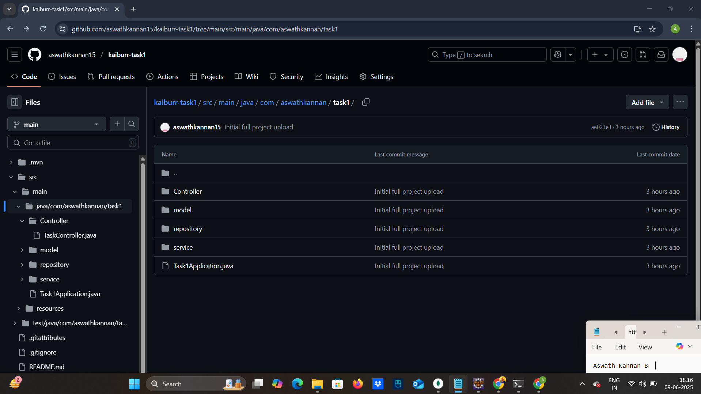
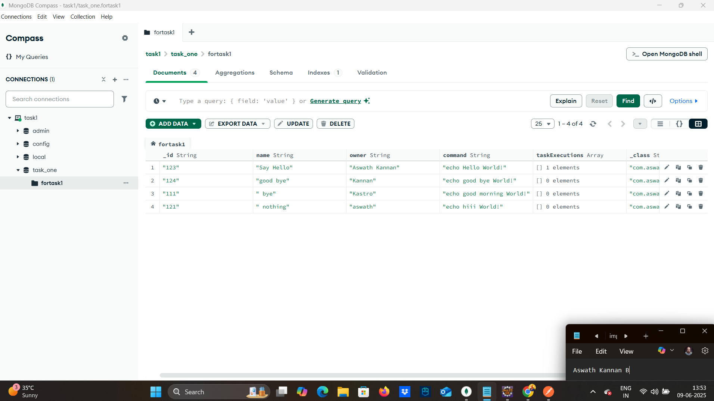
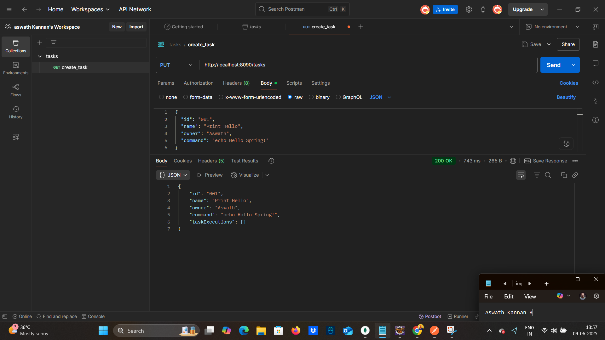
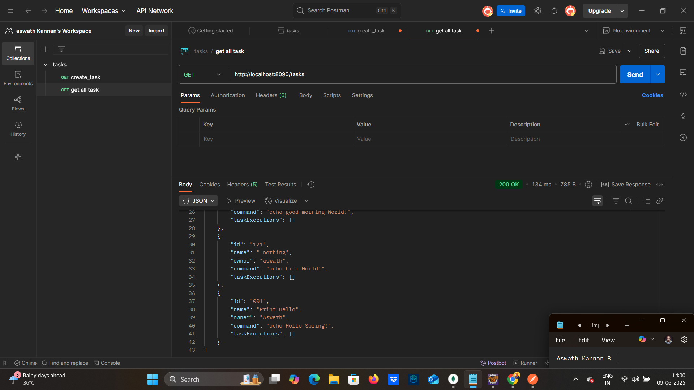
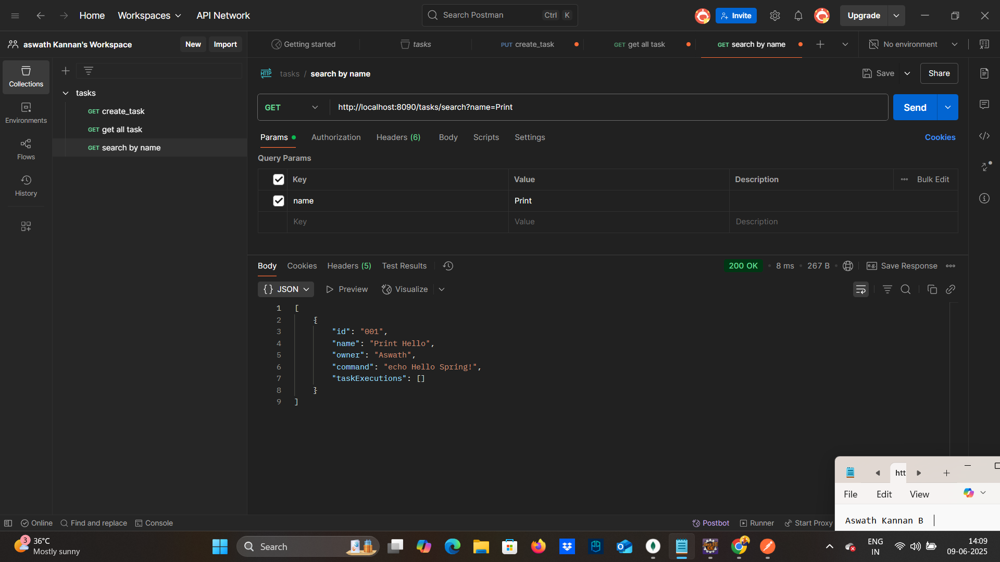
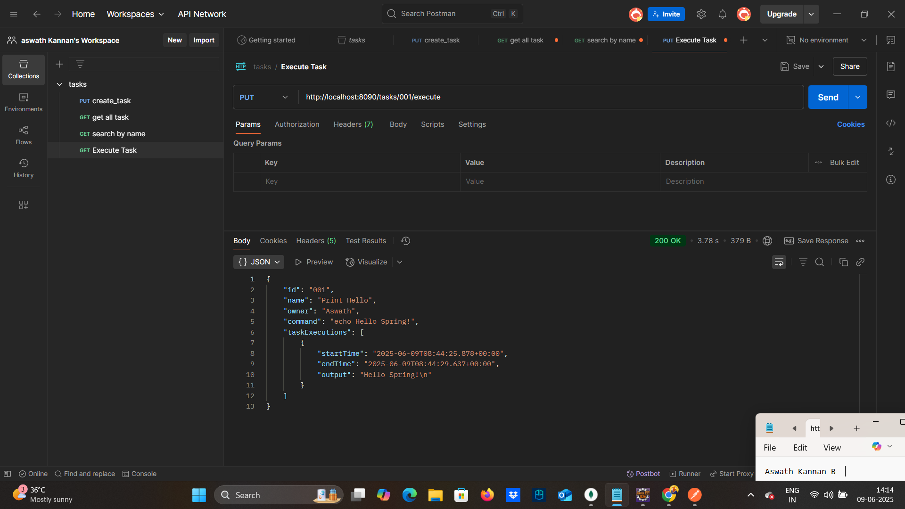
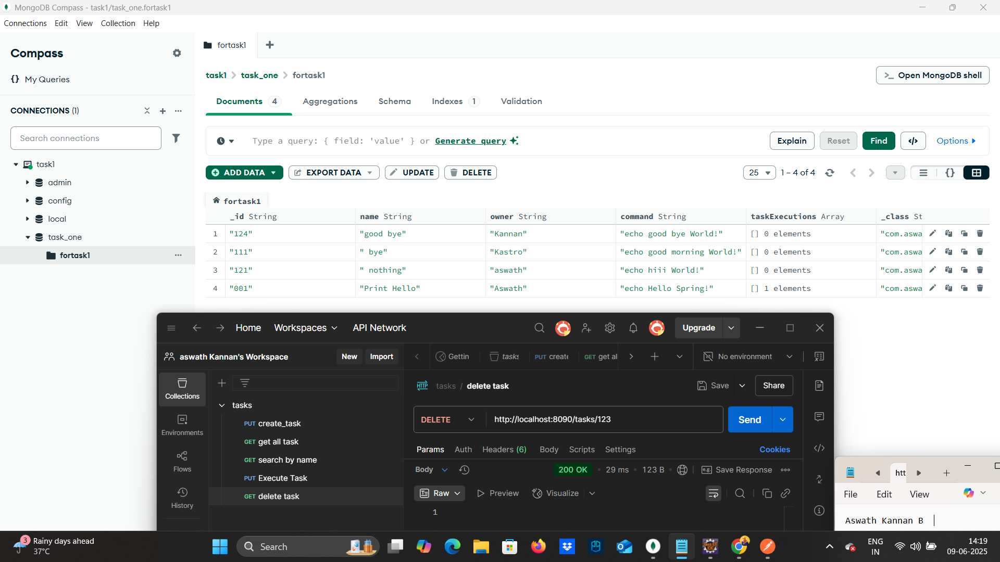

# Java backend and REST API example.

A simple Spring Boot REST API for creating, running, and managing tasks, where each task runs shell commands and stores execution results in MongoDB.

---

## Technologies Used

- Java 17+
- Spring Boot
- Spring Data MongoDB
- MongoDB 
- Postman

---
## Features / Endpoints

| METHOD | ENDPOINT                  | FUNCTION                                      |
|--------|---------------------------|-----------------------------------------------|
| `GET`  | `/tasks`                  | Get all tasks or a task by ID (`?id={id}`)    |
| `PUT`  | `/tasks`                  | Create a new task                             |
| `DELETE` | `/tasks/{id}`           | Delete task by ID                             |
| `GET`  | `/tasks/search?name=x`    | Search tasks by partial name                  |
| `PUT`  | `/tasks/{id}/execute`     | Execute task's shell command and save result  |

Each task object includes:
- `id` – Task ID
- `name` – Task Name
- `owner` – Task Owner
- `command` – Shell command to run
- `taskExecutions` – List of executions (startTime, endTime, output)

---
## Project Structure
```bash
src/
├── Controller
│ └── TaskController.java
├── model
│ ├── Task.java
│ └── TaskExecution.java
├── repository
│ └── TaskRepo.java
├── service
│ └── TaskService.java
└── Task1Application.java
```
### Github repo showing all files

---
## How to Run 
### Prerequisites
- Java 17+ installed
- MongoDB installed locally and running at localhost
- Maven installed

1.Clone the repo
```bash
git clone https://github.com/aswathkannan15/kaiburr-task1.git
cd kaiburr-task1
```
2.Build the project
```bash
./mvnw clean install
```
3.Run the app
```bash
./mvnw spring-boot:run
```
4.Verify it’s working
```bash
http://localhost:8090/tasks
```
---
## Tasks Screenshots

### MongoDB running


### Creating a Task


### Getting tasks


### Searching tasks


### Executing a command


### Deleting tasks


